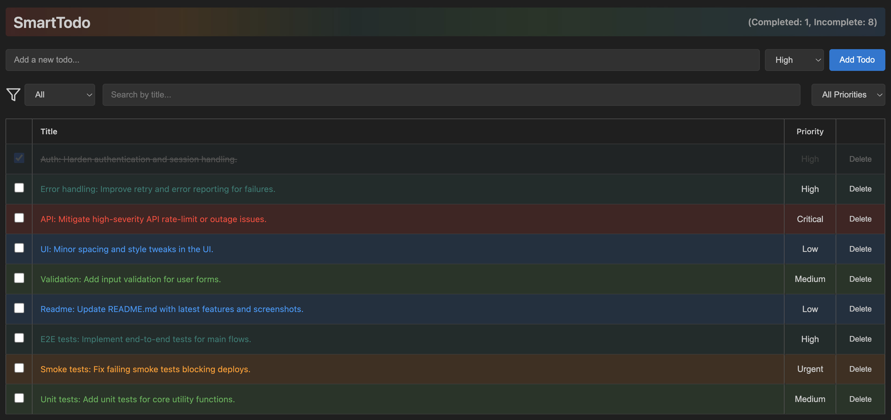

# SmartTodo

> ✨ A powerful, intelligent todo management extension for Visual Studio Code



**SmartTodo** is a feature-rich VS Code extension that brings sophisticated task management directly into your editor. With advanced filtering and seamless persistence, managing your todos has never been easier.

---

## 🎯 Features

### 📝 Todo Management
- **Create, Read, Update, Delete** todos effortlessly
- Clean, intuitive interface integrated directly into VS Code
- No external dependencies or configuration needed

### 🎨 Smart Prioritization
- Assign priorities to your tasks: **Low**, **Medium**, **High**, **Urgent**, **Critical**
- Visual distinction for each priority level with colors and icons
- Quickly identify and focus on what matters most

### 🔍 Advanced Filtering
- Filter by **Title** (partial matches, case-insensitive)
- Filter by **Completion Status**
- Filter by **Priority Level**
- **Multi-field filtering** - combine multiple filters for precise results
- Real-time filtering as you type

### 💾 Data Persistence
- All todos are saved locally on your machine
- Automatic persistence across VS Code sessions
- Data survives system restarts

### 🎭 Theme Support
- Full support for VS Code **Light** and **Dark** themes
- Automatically adapts to your theme preference
- Consistent, visually appealing appearance

### 📱 Responsive Design
- Optimized for various screen sizes and resolutions
- Readable and navigable on all devices
- Professional, clean interface

---

## 🚀 Getting Started

### Installation

1. Open Visual Studio Code
2. Go to **Extensions** (Ctrl+Shift+X / Cmd+Shift+X)
3. Search for **"SmartTodo"**
4. Click **Install**

### Quick Start

1. Open the Command Palette (Ctrl+Shift+P / Cmd+Shift+P)
2. Run **"SmartTodo: Open Todo List"**
3. Start creating and managing your todos!

---

## 📖 Usage Guide

### Creating a Todo
Click the **"+ New Todo"** button or use the input field to add a new task.

### Managing Todos
Each todo item displays as:
```
[☐] Do something (High)
```

- **Checkbox**: Click to toggle completion status
- **Title**: Click to edit the todo title
- **Priority**: Click to change the priority level
- **Delete**: Click the delete icon to remove the todo

### Filtering Your Todos
Use the **Filter** panel to:
- Search by title keywords
- Show only completed or incomplete todos
- Filter by specific priority levels
- Combine multiple filters

### Visual Indicators
- **Completed todos**: Appear faded/grayed out
- **Priority colors**: Each priority level has a distinct color for quick visual scanning
- **Dark/Light themes**: Automatically matches your VS Code theme

---

## 📄 License

This project is licensed under the MIT License.

---

## 🙏 Feedback

Have suggestions or found a bug? Please open an issue on our repository. Your feedback helps us improve SmartTodo!

---

**Happy task managing! 🎉**
